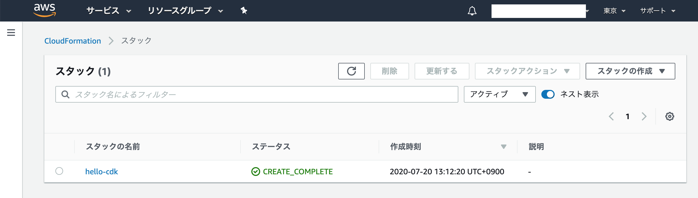

# Pythonで始めるAWS CDK

AWS CDK＋Pythonの記事が少なかったので書いてみた。
内容はAWS CDKのインストール〜デプロイまで

## 実行環境

* OSX Catalina 10.15.5
* Node.js v12.18.2
* aws cdk 1.52.0
* Python 3.7.4

## はじめに

### AWS CDKってなに？

[AWS クラウド開発キット](https://aws.amazon.com/jp/cdk/)より

> AWS クラウド開発キット (AWS CDK) は、使い慣れたプログラミング言語を使用してクラウドアプリケーションリソースをモデル化およびプロビジョニングするためのオープンソースのソフトウェア開発フレームワークです。

かなり大雑把にまとめると、使い慣れたプログラミング言語でAWSのリソースを定義、作成できるIaC(Infrastructure as Code)ツールですよっと。

### なんでAWS CDKなの？

環境設定をコードで管理したい。けどterraformとかに手を出すほどでもないし、template.ymlは書きたくない…。何よりAWSの公式！

### なんでPythonなの？

(TypeScript分からないから…)
LambdaをPythonで書いていたからその延長線上でPythonでやってみた

### 使ってみた感想

* 後述するが間接的にCloudFormationを使用しているので、実務で使用する場合は[AWS CloudFormation の制限](https://docs.aws.amazon.com/ja_jp/AWSCloudFormation/latest/UserGuide/cloudformation-limits.html)は一読しておくことをお勧めする。
* リリースは頻繁にされているので日々改善されているようだが、使い込んでいくと正直、現状では痒いところに手が届かない感が否めない。少なくともクロススタック参照はなんとかして欲しい。

## AWS CDKのインストール

* [Getting started with the AWS CDK](https://docs.aws.amazon.com/cdk/latest/guide/getting_started.html)を参考に進めていく。

### Node.jsのインストール

前提として、Node.jsが必要なのでインストールされていない場合はまずこちらをインストールする
なぜNode.jsが必要かというと、AWS CDK自体はTypeScriptで書かれており、Pythonなど他の言語はjsiiというライブラリで自動的にTypeScriptに変換してくれているらしい。すごい。

[AWS クラウド開発キットのよくある質問](https://aws.amazon.com/jp/cdk/faqs/)

> Q: AWS CDK を使用するために JavaScript ランタイムをインストールする必要があるのはなぜですか?
AWS は、AWS Construct ライブラリパッケージのビジネスロジックを TypeScript で構築し、サポートされている各プログラミング言語へのマッピングを提供します。これにより、AWS CDK コンストラクトの動作が異なる言語間で一貫していることを確認でき、すべての言語で利用できる包括的なコンストラクトパッケージのセットを提供できます。AWS CDK プロジェクトで作成したコードはすべてお客様ご希望のプログラミング言語でネイティブになっています。JavaScript ランタイムはお客様のプログラミング経験の実施詳細です。jsii プロジェクトは https://github.com/aws/jsii で参照できます。

Node.jsのインストール自体は簡単で、[Node.jsの公式](https://nodejs.org/en/download/)からインストーラをダウンロード。あとはインストーラに従ってポチポチしていけば勝手にインストールしてくれる。

インストールが完了したらバージョンを確認

```sh
$ node -v
v12.18.2
$ npm -v
6.14.5
```

### AWS認証情報の設定

AWS CLIがインストールされている場合は`aws configure` コマンドを実行すればプロンプトで設定可能だが、わざわざAWS CLIインストールしたくない場合は手動で設定する。

以下はmac or linuxの設定手順。Windowsの場合は`%USERPROFILE%\.aws\config` と `%USERPROFILE%\.aws\credentials`を作成し、認証情報、リージョンを設定する

```sh
$ mkdir ~/.aws
$ touch ~/.aws/config
$ touch ~/.aws/credentials
```

エディタで`~/.aws/config`を開き、以下の通りリージョンを設定し、保存する

```vi
[default]
region=ap-northeast-1
```

エディタで`~/.aws/credentials`を開き、以下の通り認証情報を設定し、保存する。

```sh
[default]
aws_access_key_id={アクセスキーID}
aws_secret_access_key={シークレットアクセスキー}
```

### AWS CDKのインストール

npmを使用してインストールする

```sh
$ sudo npm install -g aws-cdk
```

バージョンを表示し、インストールされていることを確認。

```sh
$ cdk --version
1.52.0 (build 5263664)
```

デプロイ用S3バケットの作成

`cdk bootstrap`コマンドでCloudFormationで使用するS3バケットを作成する
これはリージョンごとに実施する必要があるので注意。

```
$ cdk bootstrap
 ⏳  Bootstrapping environment aws://323617333195/ap-northeast-1...
CDKToolkit: creating CloudFormation changeset...


 ✅  Environment aws://323617333195/ap-northeast-1 bootstrapped.
```


## CDK appを作る

* [Your first AWS CDK app](https://docs.aws.amazon.com/cdk/latest/guide/hello_world.html)を参考に進めていく。

プロジェクトディレクトリを作成

```sh
mkdir hello-cdk
cd hello-cdk
```

`cdk init`コマンドを実行

```sh
cdk init app --language python
```

実行が終わったらvirtualenvを起動する
(pip3を使用している場合はpip3に読み替えて実行すること)

```sh
source .env/bin/activate
pip install -r requirements.txt
```

pipenvを使用したい場合は、virtualenvを起動せずに`.env`ディレクトリを削除して代わりにpipenvを起動する

### S3バケットを作成してみる

```sh
pip install aws-cdk.aws-s3
```

hello_cdk_stack.pyにs3バケットを作成するコードを追加する
(bucket_nameは既存のバケット名と重複するとデプロイ時にエラーになるため、重複しないものへ書き換えること)

```py
from aws_cdk import core
from aws_cdk import aws_s3 as _s3


class HelloCdkStack(core.Stack):

    def __init__(self, scope: core.Construct, id: str, **kwargs) -> None:
        super().__init__(scope, id, **kwargs)

        # The code that defines your stack goes here
        bucket = _s3.Bucket(self, "MyFirstBucket", bucket_name="kimi-first-cdk-bucket")
```

デプロイコマンドを実行

```
$ cdk deploy
hello-cdk: deploying...
hello-cdk: creating CloudFormation changeset...


 ✅  hello-cdk

Stack ARN:
arn:aws:cloudformation:ap-northeast-1:323617333195:stack/hello-cdk/3497b790-ca3f-11ea-9236-0eb7b90bbf8e
```

デプロイ完了後にAWSマネジメントコンソールでS3バケットが作成されていることを確認できた


AWSマネジメントコンソールでCloudFormationを開くと`hello-cdk`というスタックができている。



これはAWS CDKがリソースを作成するのにCloudFormationを使用しているため。
`cdk synth`コマンドを実行すればCloudFormationテンプレートを出力することもできる。

```sh
$ cdk synth
```

また、作成したリソースを全て削除したい場合は`cdk destroy`コマンドでスタック単位でリソースを削除することが可能。
ただし、S3バケットなど削除されないリソースが一部あるので注意が必要。

```sh
$ cdk destroy
```

### Lambdaをデプロイしてみる

#### シンプルなLambda関数をデプロイする

新しいプロジェクトを作成。

```sh
$ mkdir cdk-lambda
$ cd cdk-lambda/
$ cdk init app --language python
```

せっかくなのでPipenvを使ってみる。

```sh
$ rm -rf .env
$ rm -rf source.bat
$ rm -rf requirements.txt
$ pipenv shell
```

必要なパッケージをインストール

```sh
$ pipenv install aws_cdk.core
$ pipenv install aws_cdk.aws_lambda
```

Lambda関数を置くディレクトリを作成し、Lambda関数のPythonファイルを作成

```sh
$ mkdir function
$ touch function/index.py
```

今回はあくまでもサンプルなので、Lambdaのコードは適当

```py
import json

print('Loading function')


def lambda_handler(event, context):
    print("value1 = " + event['key1'])
    print("value2 = " + event['key2'])
    print("value3 = " + event['key3'])
    return event['key1']  # Echo back the first key value
```

`cdk_lambda_stack.py`にLambda関数を作成するコードを追記

```py
from aws_cdk import core
from aws_cdk import aws_lambda as _lambda


class CdkLambdaStack(core.Stack):

    def __init__(self, scope: core.Construct, id: str, **kwargs) -> None:
        super().__init__(scope, id, **kwargs)

        # The code that defines your stack goes here
        lambdaFn = _lambda.Function(self, "SampleLambdaFunction", 
            code=_lambda.Code.from_asset('function/'),
            runtime=_lambda.Runtime.PYTHON_3_7,
            handler="index.lambda_handler",
            function_name="sample_lambda_function"
        )
```

いざ、デプロイ！

```sh
$ cdk deploy
```

AWSマネジメントコンソールでデプロイされていることを確認。


#### Lambda関数に環境変数を設定する

Functionを作成する際に`environment`パラメータを指定するか、`add_environment`メソッドで設定する

```py
        # 環境変数を追加
        lambdaFn.add_environment(key="STAGE", value="DEV")
```


#### s3トリガーを設定する

必要なパッケージをインストール

```sh
$ pipenv install aws_cdk.aws_s3
$ pipenv install aws_cdk.aws_s3_notifications
```

s3バケットを作成し、通知イベントを設定。
今のところ、この方法では既存のS3バケットには設定できない。既存のS3バケットにイベントを設定したい場合はカスタムリソースを使用する。

```py
        bucket = _s3.Bucket(self, "SampleBucket", bucket_name="kimi-first-cdk-bucket")
        notification = aws_s3_notifications.LambdaDestination(lambdaFn)
        bucket.add_event_notification(_s3.EventType.OBJECT_CREATED, notification, _s3.NotificationKeyFilter(prefix="hoge", suffix=".csv"))
```


## 参考

* [AWS CDK Examples](https://github.com/aws-samples/aws-cdk-examples) サンプルコード集。言語によって差はあるが、いろいろ揃っているのでかなりありがたい

* [AWS CDK Pythonリファレンス](https://docs.aws.amazon.com/cdk/api/latest/python/index.html)
